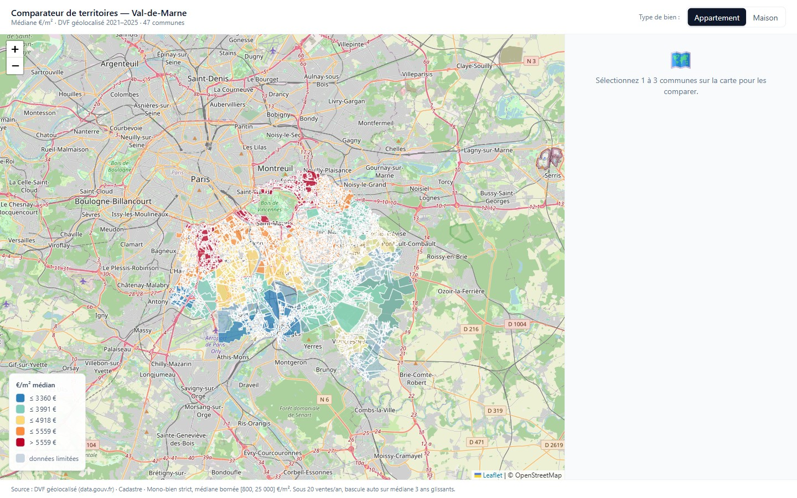
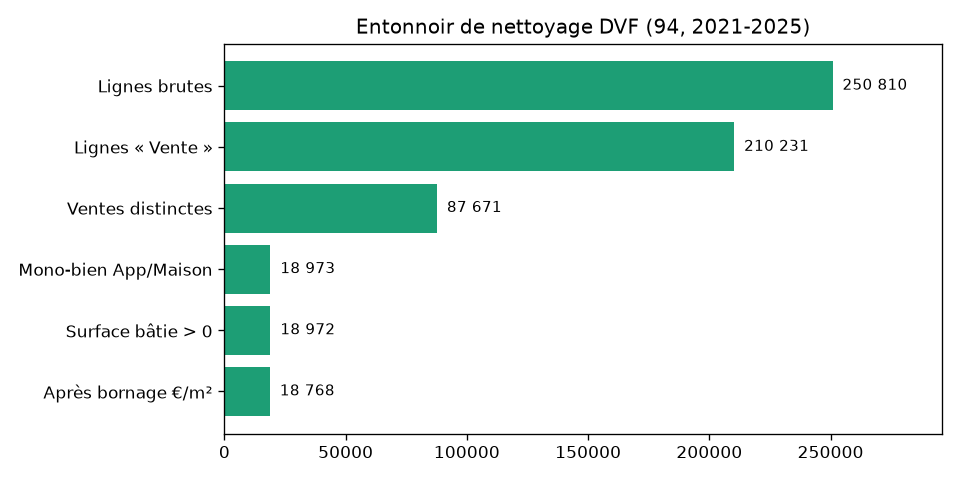
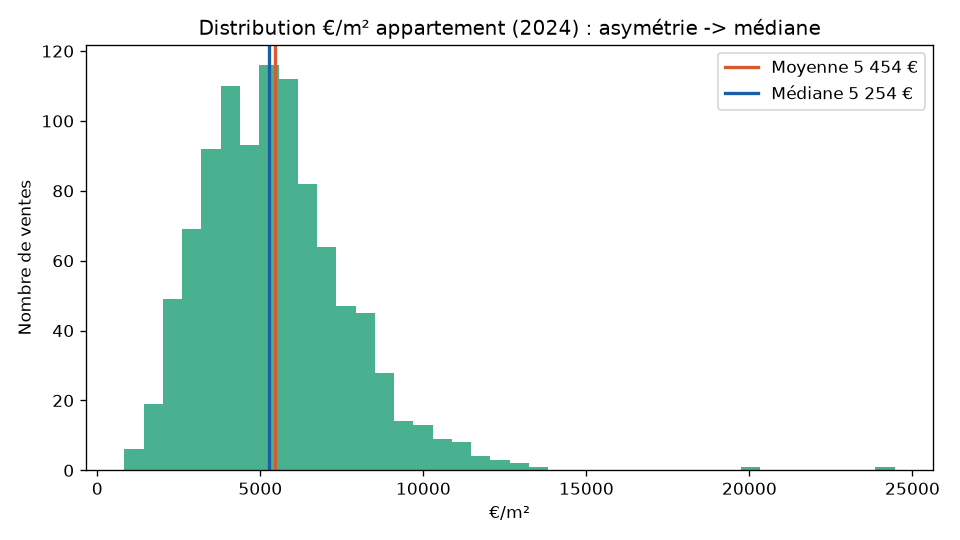
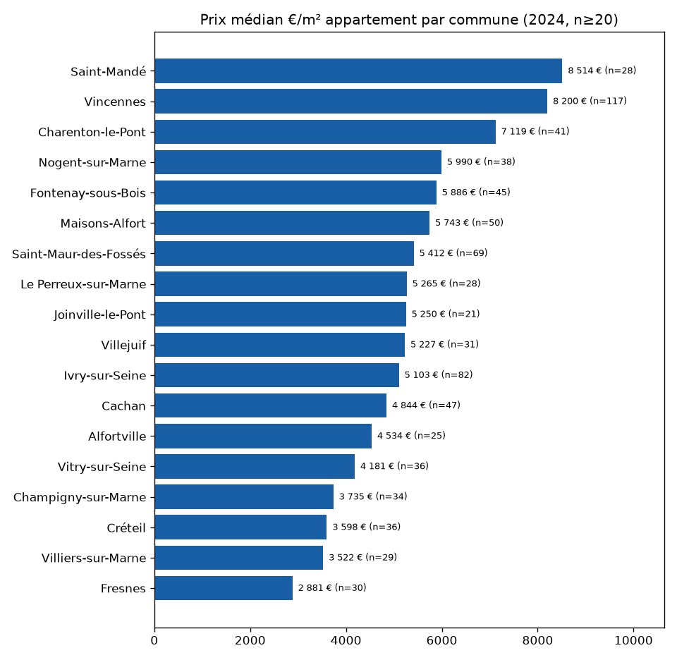

# Architecture & méthodologie

> Application full-stack qui compare les **47 communes du Val-de-Marne (94)** sur des indicateurs immobiliers DVF : choroplèthe interactive + comparaison côte à côte.

**Démo en ligne :** https://real-estate-94.onrender.com



## Chiffres clés

- **47 communes** du 94 sur **5 millésimes** (2021–2025)
- **250 810 lignes brutes** DVF → **18 768 ventes exploitables** après nettoyage
- Écart **×3** entre communes : Saint-Mandé 8 514 €/m² vs Fresnes 2 881 €/m² (appart 2024)
- Seulement **18 communes sur 47** au-dessus du seuil de fiabilité (≥ 20 ventes appart/an)

---

## Granularité : pourquoi la commune

Alternatives écartées :
- **IRIS** (sous-quartier) : trop fin pour DVF en zone résidentielle, on n'a pas assez de ventes par maille pour calculer une médiane robuste.
- **Parcelle** : signal trop bruité, perd la lisibilité d'une comparaison territoriale.

La **commune** est le bon compromis : 47 mailles affichables sur une choroplèthe d'un coup d'œil, agrégat statistiquement viable sur les communes denses, et c'est la granularité que les acteurs publics utilisent.

## Pipeline ETL

```
download.py  →  clean.py  →  aggregate.py  →  build_db.py
   CSV.gz         filtre        médianes        SQLite
```



> **250 810 lignes brutes → 18 768 ventes exploitables.** Chaque étape retire ce qu'on ne peut pas exploiter pour un €/m² fiable : refus, dédoublonnages de mutations, mutations multi-biens, surface nulle, prix aberrants.

## Règles métier verrouillées

Ces règles ont été validées sur la vraie donnée et **structurent l'API et l'UI**. Elles ne doivent pas être contournées sans relire ce document.

### Mono-bien strict

On n'agrège qu'une mutation contenant **exactement 1 local bâti** de type `Appartement` ou `Maison` avec `surface_reelle_bati > 0`. Sinon, `valeur_fonciere` mélange plusieurs biens et le €/m² n'a plus de sens.

### €/m² borné à [800, 25 000]

Borne Île-de-France retire ~200 aberrations (saisies manuelles, valeurs symboliques type 1 €) sans amputer la distribution réelle.

### Médiane, jamais moyenne



> Distribution asymétrique : moyenne 5 454 €/m² > médiane 5 254 €/m² sur les appartements 2024. La moyenne se laisse tirer vers le haut par les ventes haut-de-gamme — la médiane reflète mieux ce qu'on observe réellement.

### Toujours séparer Appartement / Maison

On ne mélange **jamais** les deux dans un même indicateur. Contre-intuitivement, la maison dépasse souvent l'appart au m² (Vincennes 2024 : maison 10 388 €/m² vs appart 8 200 €/m²) — moyenner les deux donnerait un chiffre faux.

### Fiabilité : médiane glissante 3 ans + grisage UI

Seules **18 communes sur 47** ont ≥ 20 ventes d'appartements en 2024. Sous ce seuil, l'API expose une **médiane sur 3 ans glissants** (la médiane n'étant pas linéaire, elle est recalculée depuis les ventes brutes, pas reconstruite depuis les agrégats annuels) et le front grise / avertit visuellement.

### Le creux de volume est 2024, pas 2025

13 996 ventes en 2024 contre 16 362 en 2025. Erreur d'intuition fréquente (« le dernier millésime est tronqué ») — ici c'est bien le point bas réel du marché.

### Écart territorial ×3



> Du sud-est (Fresnes, Orly, Valenton) au nord-ouest (Saint-Mandé, Vincennes), le €/m² appartement varie d'un facteur 3 sur une zone de 245 km². C'est précisément ce que la choroplèthe rend visible.

---

## Schéma SQLite

`backend/data/data.db` — 1,5 Mo, 3 tables :

| Table | Lignes | Contenu |
|---|---|---|
| `commune` | 47 | `code_commune` (PK), `nom_commune`, `nb_parcelles`, `surface_cadastrale_m2` (joint depuis le geojson cadastral dissous) |
| `indicateur` | ~460 | PK composite `(code_commune, annee, type_bien)`, médiane/p25/p75 du €/m², nb_ventes, surface médiane |
| `vente` | 18 768 | Lignes nettoyées, conservées pour recalculer la **vraie** médiane 3 ans glissants à la demande |

> Pourquoi garder la table `vente` ? La médiane n'est pas linéaire — impossible à reconstruire depuis les agrégats annuels. Coût : +600 Ko. Gain : exactitude des fallbacks sous seuil de fiabilité.

## API (FastAPI)

3 endpoints sous `/api` :

| Endpoint | Réponse |
|---|---|
| `GET /api/communes` | Liste des 47 communes + €/m² du dernier millésime + médiane 3 ans, par type |
| `GET /api/communes/{code}` | Tous les indicateurs (5 ans × 2 types) pour une commune |
| `GET /api/compare?codes=94001,94067,94080` | Payload comparatif pour 2-3 communes (max 5) |

L'API expose `prix_m2_*` (millésime courant) et `prix_m2_3ans_*` séparément — c'est le front qui choisit lequel afficher selon le seuil de fiabilité.

Plus deux routes statiques : `/communes_94.geojson` (591 Ko, geojson des contours cadastraux) et `/` (front React buildé).

## Front

- **React 18 + Vite** : SPA légère, dev avec HMR via proxy `/api` → `:8000`.
- **Leaflet + react-leaflet** : choroplèthe avec dégradé d'échelle par quintile.
- **Recharts** : tendance €/m² (ligne) + comparaison par type (barres).
- **Tailwind 4** : mise en page sobre.
- Sélection multi-communes (max 3) au clic carte, avec **grisage visuel** des communes sous le seuil de fiabilité.

## Déploiement

**Un seul conteneur Docker** sert tout (API + front + DB + geojson) :

```
┌──────────────────────────────────────────┐
│  python:3.12-slim  (user `app`, port 8000) │
│  ├── uvicorn → FastAPI                    │
│  │     ├── /api/*       (routes.py)        │
│  │     ├── /communes_94.geojson           │
│  │     └── /            (front React)      │
│  └── backend/data/data.db (SQLite, ro)    │
└──────────────────────────────────────────┘
       ▲
       │ multi-stage build
       │
┌──────────────────────────────┐
│  node:20-alpine (build only) │
│  npm ci && npm run build     │
│  → frontend/dist/             │
└──────────────────────────────┘
```

Hébergement **Render** (free tier, Web Service Docker) déclaré en IaC dans `render.yaml` :
- Région Frankfurt, autoDeploy sur push GitHub
- `HEALTHCHECK` Python sur `/health` (interval 30 s)
- Cold start ~30 s sur free tier — réveiller l'URL 5-10 min avant une démo

Image finale ~250 Mo, build ~5-8 min.

## Limites & extensions possibles

- **Drill-down parcellaire au clic** : zoomer sur une commune montrerait les parcelles individuelles avec leur €/m² historique.
- **Migration Postgres / PostGIS** : nécessaire si on veut indexer le geojson côté serveur ou élargir à plusieurs départements.
- **Élargissement multi-départements** : la pipeline ETL accepte n'importe quel département DVF — il suffit de paramétrer `download.py` et de dissoudre le cadastre correspondant.
- **Cache HTTP + GZip** sur `/api/communes` et le geojson : gain de bande passante immédiat (~75 % sur le geojson), pas implémenté car pas critique au volume actuel.
